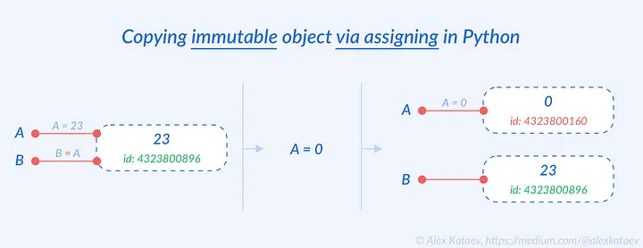

# Research notes:
## Authors Note:
This file is to contain my research on the inner workings of python. The main things that will be address is safety, best practice, and computation speed. I am making this for my benefit and others who will work with the CSE simulator coding base. What will follow is a list of topics that I have researched and why I decided to code the simulator the way I did. I will also leave notes about things that did and didn't work when I made this system. I hope this will be useful to the reader. 

## Threading
I started have some major concerns about data safety when I was working on the system. The number of thread quickly grew from 1 to 2 then 3 then  10 and now we are easily working with over a dozen threads. Lets look at different ways of using mutex locks and see witch one is the safest. 

### Typing in python
Python has two main typings behind the curtain that will become relevant. Immutable, and Mutable. Immutable data types CAN NOT be changed after they are declared. (This is a direct artifact of python being writer in c and c++). Mutable types can be changed after they are declared. 

| Immutable | Mutable |
| ---- | ---- |
| Numbers | list |
| string | dict |
| Tuple | set |
| frozen set | byte array |
| byte |  |

Note: The above list is not compressive, but is given by way of example. 

#### Now lets consider how python works with its Immutable types. 


The above example shows how an immutable variable is declared in python. Note that the token name of the variable is assigned to the memory location not to the value of the actual variable. Now lest consider what happens when we create a second token for the same variable. 

```python
    A = 23
    B = A
    A = 0
```
NOTE: in this case A and B are the token names for the variables. 




https://alexkataev.medium.com/magic-python-mutable-vs-immutable-and-how-to-copy-objects-908bffb811fa


## Events NOTE:
makes sure the event function that is called is to large as it will shut down the whole classes thread for a short time. 