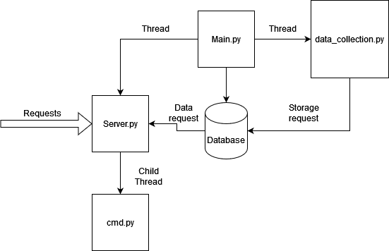
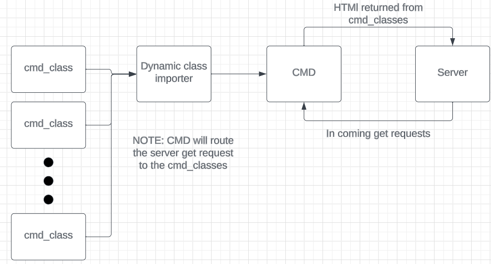

# Server overview
This document contains many exsamples. They are all write with 127.0.0.1 witch the home address when running on other computers this needs to be replace with the IP of the computer you want to talk to. 


## clone repo
    NOTE: this repo has submodels and must be clone with the `git clone --recurse-submodules <repo url>`.

## `Main.py` 
Handles starting and running the server. It also creates an object for `server`, `taskHandler` (threading), and `data_collection`.



## `Server`
This class handles all incoming request and routes them to `cmd_inter` returns the html page and what ever `cmd_inter` returns to the webpage.

### functions:
1. `__init__ `: this is pythons constructor. It builds the basic varibles needed for the class.
2. `setup_routes`: this sets up and get rounts that can be requested.
3. `run` : this function starts the server. It request the port and if it can access it then it starts the server up.
4. Other functions not listed: These functions are call backs that tie into the get requests. Basically when the users makes a git request one these function is called.

## `Server_messaage_handler`
This class handles all interal messaging to the server. The server has a very high load, so this class handles collecting and storing messages to the server class. 

### functions:
1. `write_` or `report`: These functions are requested by other threads. They take a messages and store it for the server.
2. `get_`: These functions are called by the server and return the stored messages. 


## `cmd_inter`
This class handles any incoming commands. It has one very important varible and 3 member functions. 

### Varibles:
1. `self.__commandDict` : This is a python dictionary. It works like a list but instead of using numbers to index it, you can use what ever you want. In this case I use the names of the commands to index into the this dictionary. The dictionary contains a list of pointers to the classes that have been imported by the `dinamicImporter` class (see below). Basically when a get request comes the server the first arg is passed in to the dictionary to see if it maps to a class. \
EX: "127.0.0.1:5000/exsample", 'exsample' is used to index the dictionary.

### Functions:
1. `parseCmd`:  This funct handles passing commands and then calling the correct class using the self.__commandDict. \
NOTE:  The follow code is used to decided if there are any arguments that need to passed on to the the cmd class. 
\
EX: "127.0.0.1:5000/exsample" class ``.run()`` on the class where as "127.0.0.1:5000/exsample/args" calls `.run(message[1:])`. One other thing to note is that `message` is a LIST! So for the second EX it looks like `message = ['exsample', 'args']`. It is important that the LIST gets pass on to the class, and NOT and indivdual arg. This is so that if the user wishes to have mutiple args the server can suport this. \
EX: "127.0.0.1:5000/exsample/arg1/arg2/arg2" => `message = ['exsample', 'arg1', 'arg2', arg3]`. The command class will see `['arg1', 'arg2', arg3]`.

    ```python
    if(len(message) == 1):
            return self.__commandDict[message[0]].run()
        else :
            return self.__commandDict[message[0]].runArgs(message[1:])
    ```

2. `getCommandDict`: This class is a simple getter so that other class may see the command dictionary if they need it. 

3. `collectCommands`: This fuct calls the dinamicImporter class and then gets a list of modules, then it turns these modulas in to runable class. 

4. `__init__`: this func calls the `collectCommands` and sets up the `self.__commandDict`.

## `dinamicImporter`
This class is simple. All it does is search the current directry for any python file that is lead with `cmd_`. If it finds a file with that tag, it turns it into a python module and that can then be turn into a class and run as a commond by the server. \

(PS: I know dinamic spelled wrong but I speak spanish so to me its spelled just fine!)

### Functions:

1. `__init__` : this function finds all the `cmd_` python files and turns them into modules

2. `getModList`: returns the list of modules that can be run. 


 \


## `commandParent`
This class IS NOT strictly nessary for a functionality purpose. However, it is used to make it easier to make new commands. Bassically it has all the command function that have to be there for the server to run. If the user decides not to implement one of the functions the the command parent will have a basic version so that the server dose not fail. \
EX: if the user does not want a `runArgs(self, args)` function they dont need one.\
NOTE: I STRONGLY recomend having an `__int__` and `__str__` function dispite the command parent implementing them for you. 

## `cmd_exsample`
This clas is meant to be a helpo for the user as it provides an exsample of how to implement a `cmd_` class. 

### functions
1. `__init__`: this funct does sever imporant things. First it taks in the CMD arg. This is a refrence to the `cmd_inter` class. it will add its self to the command dictionary in that class with the flowing code

    ```python 
    dictCmd = CMD.getCommandDict()
    dictCmd[self.__comandName] = self #this is the name the webserver will see, so to call the command send a request for this command. 
    CMD.setCommandDict(dictCmd)
    ```
    The var `self.__commandName` this is the name of the command that the server will expect in order to run the command. \
    The last bit of code witch is VERY imporant is the following: \

    ```python
    self.__args ={
            "arg1" : self.func1
        }
    ```

    The `self.__args` var is how commands with args are run. Bassically this is a python dictinary that holds a pointer to a function, so when the dictionary is index with the key work "arg1" it calls `self.func1`. 

    EX: to call func1 send this get request `http://127.0.0.1:5000/exsample/arg1`

2. `run` : This  func gets called if no args are passed on the get request.

3. `runArgs` : this func gets called if args are passed on the get request. 

    ```python
    try:
        message += self.__args[args[0]](args)
    except :
        message += "<p> Not vaild arg </p>"
    ```

    The above code shows how the args are used to call a function. \
    NOTE: that `arg[0]` is used to index into the `self.__args` dictionary. \
    EX: `http://127.0.0.1:5000/exsample/arg1/arg2/arg3` `arg1` is passed into the dictionary. The list args contains `['arg1', 'arg2', 'arg3']`, thus `arg2` and `arg3` can be used in the function.\
    NOTE: `args` is always a list. This allows us to pass things into the fucntion. Where `self.__args` is a dictionary that is to be levarge by the interal class structure. 

4. `func1` : is an interal class function.
5. `getArgs` : is a getter used by the server to determin what argums the class suports. 
6. `__str__` : this is a function that other class relay on to determin the how to call this class. It returns the `self.__commandName` 
7. `get_args_server`: returns the args for the class in a format the server can understand. (The return value is mapped to a table that is displayed on the web page.)
## `cmd_dataCollection`
This class is the connection between the data base and the server. It follows the `cmd_` format explained above.

### functions
1. `__self__` : This sets up the struct of the class, the most important thing is the args dictionary. 

    ```python
    self.__args ={
                "tables" : self.getTableHTML_Collector,
                "getDataType" : self.getDataType,
                "saveDummyData" : self.saveDummyData,
                "getData": self.getData,
            }
    ```

2. `runArgs` :This function follows the same format and function as the one discribed in `exsample`.
3. `getTableHTML_Collector` : This function ask the data base for all the tables it has and then returns an html file with those table names in it. 
4. `getArgs` : This function dose the same as the in `exsample`, however it does have some special cases for func that need special calls. Remeber this function returns html to the server that it then passes onto the ground staion. It is meant to let the user know how to call the functions. 

    ```python
    for key in self.__args:
        if(key == "getDataType"):
            message += f"<p>&emsp;/{key}/data group</p>"
        elif (key == "getData"):
            message += f"<p>&emsp;/{key}/data group/start time</p>"
        else :
            message += f"<p>&emsp;/{key}</p>"
    ```
5. `getDataTypes` : This funciton gets a data type and then returns it. It shows the feilds, bit make, and discontinuous mappings in a data type. This will alow the ground station to decode the data. \
EX: exsample call : `http://127.0.0.1:5000/data_Collector/getDataType/exsample`\

6. `saveDummyData` : This is used for testing the data base. It saves data into the `exsample` table.
7. `getData` : this function simply ask the data base for data and then returns it as html. One thing to note is that the args should contatin a start time for requestion the data. \
EX: exsample call : `http://127.0.0.1:5000/data_Collector/getData/exsample/0` returns all saved rows in the data base. \
EX: exsample call : `http://127.0.0.1:5000/data_Collector/getData/exsample/1694027663.3701735` returns all saved rows in the data base after and including time 1694027663.3701735. 
8. `__str__` : Follows the same format as `esample`.
9. `get_args_server`: returns the args for the class in a format the server can understand. (The return value is mapped to a table that is displayed on the web page.)

## `cmd_data_publisher`
This class is tasked with creating the pipe that is used by `Cosmos` for listing to our data. Basically it recives a command fro the server to start and then makes a request to start a new thread with the  `run_publisher` as the function running on the thread. 

## `templates\`
This folder holds the html templates the the server uses to create the web page. 

## `synthetic_data_profilies\`
This folder is for storing know data profiles that can be piped out to `Comos`. This is for testing purpusos. 

## `static\`
Holds static images used by the webpage.

## `source\`
Any `Java script` need to run the web page is stored in this folder. It is then served to the webpage after the server is started. 

## `logs\`
Stores the logs created during run time by the program. 

## `DTOs\`
This file holds the definition of how interal messges are structured.

## `database\`
Hold the actual data base and the database definition file. 


## running main
The command to run main is `python3 main.py` from the host folder. Main also is a meenting point for all the other `api`'s being used. NOTE: for easy of use it is best if all the other `api`'s are in the same folder as `main.py`

## testing server

## unit tests

## Logger
The logger class conatins acces to all the logs. It takes a message write it to the file it has access to and then flushes the file. Using this system makes the files more likely to servive if the system loses power. 

## Compling with pandocs
    To complie .md to a pdf: pandoc -s README.md -V geometry:margin=1in -o README.pdf
    To complie to a stand alone html doc: pandoc  --metadata title="README" -s --self-contained README.md -o README.html

## Linting
This is the method that is used to check the code and make sure it fits coding standar and best pratice. The package is called `pylint` and can be installed with \
``` python
    pip install pylint  
```
or 
```python
    pip3 install pylint 
```
depending on context. The command to run `pylint` is:
```python
    python3 -m pylint --jobs 0 --rcfile .pylintrc <name of python file or folder>
```