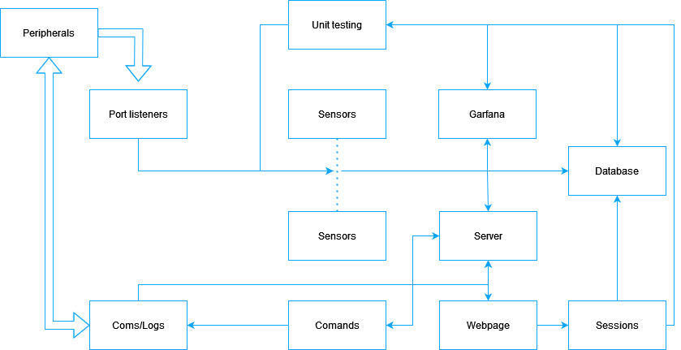

# Peripheral overview
This Document provides an overview of how the peripherals should be structure in order to set up a connection the CSE Host and pass data to them. The main purpose of this document it to help the user set up peripherals.

## Key concepts:
- Commands start with `cmd_` these are executable by the server. (See the `HOWTO.md` for instruction on how to create them.)
- Sensor objects collect, process, then publish data they start with `sobj_`. (See the `HOWTO.md` for instruction on how to create them.)
- The `message_handler.py` is the internal communication class it is often referred to as `coms` or `self.__coms`.
- Class will listen to each others data using a method called `taps`. The basics is when an object wants to publish data, it reads from a list of functions to call, then send the data using the functions in that list.


## clone repo
NOTE: this repo has submodels and must be clone with the 
```bash
git clone --recurse-submodules <repo url>.
```


## `Main.py`
Handles creating objects for the system to use. It creates most of the big objects used by the system such as the `server`, `taskHandler` (threading), and `Serial_listeners`.





## `Server`
This class handles all incoming request and routes them to `cmd_inter` returns the html page and what ever `cmd_inter` returns to the webpage. 


###  Major functions:
1. `__init__ `: this is pythons constructor. It builds the basic variables needed for the class.
2. `setup_routes`: this sets up and get routes that can be requested.
3. `run` : this function starts the server. It requests the port and if it can access it then it starts the server up.
4. Other functions not listed: These functions are call backs that tie into the get requests. Basically when the user makes a git request one these functions are called.

## `data_publisher`
It is given a data steam to publish via a tap, then it publishes that data onto the network once a host connects to the pipe. 


## `Server_message_handler`
This class handles all internal messaging to the server. The server has a very high load, so this class handles collecting and storing messages to the server class.


### functions:
1. `write_` or `report`: These functions are requested by other threads. They take a messages and store it for the server.
2. `get_`: These functions are called by the server and return the stored messages.


## `cmd_inter`
This class handles any incoming commands. It has one very important variable and 3 member functions.


### Variables:
1. `self.__commandDict` : This is a python dictionary. It works like a list but instead of using numbers to index it, you can use whatever you want. In this case I use the names of the commands to index into this dictionary. The dictionary contains a list of pointers to the classes that have been imported by the `dinamicImporter` class (see below). Basically when a get request comes to the server the first arg is passed in to the dictionary to see if it maps to a class. \
EX: "127.0.0.1:5000/example", 'example' is used to index the dictionary.


### Functions:
1. `parseCmd`:  This func handles passing commands and then calling the correct class using the self.__commandDict. \
NOTE:  The following code is used to decide if there are any arguments that need to be passed on to the cmd class.
\
EX: "127.0.0.1:5000/exsample" class ``.run()`` on the class whereas "127.0.0.1:5000/exsample/args" calls `.run(message[1:])`. One other thing to note is that `message` is a LIST! So for the second EX it looks like `message = ['example', 'args']`. It is important that the LIST gets pass on to the class, and NOT an individual arg. This is so that if the user wishes to have multiple args the server can support this. \
EX: "127.0.0.1:5000/exsample/arg1/arg2/arg2" => `message = ['example', 'arg1', 'arg2', arg3]`. The command class will see `['arg1', 'arg2', arg3]`.


    ```python
    if(len(message) == 1):
            return self.__commandDict[message[0]].run()
        else :
            return self.__commandDict[message[0]].runArgs(message[1:])
    ```


2. `getCommandDict`: This class is a simple getter so that other classes may see the command dictionary if they need it.


3. `collectCommands`: This function calls the dinamicImporter class and then gets a list of modules, then it turns these modules into runnable class.


4. `__init__`: this func calls the `collectCommands` and sets up the `self.__commandDict`.


## `dynamicImporter`
This class is simple. All it does is search the current directory for any python file that is lead with `cmd_`. If it finds a file with that tag, it turns it into a python module and that can then be turned into a class and run as a command by the server. \


### Functions:


1. `__init__` : this function finds all the `cmd_` python files and turns them into modules


2. `getModList`: returns the list of modules that can be run.


## `commandParent`
This class IS NOT strictly necessary for a functionality purpose. However, it is used to make it easier to make new commands. Basically it has all the command functions that have to be there for the server to run. If the user decides not to implement one of the functions then the command parent will have a basic version so that the server does not fail. \
EX: if the user does not want a `runArgs(self, args)` function they don't need one.\
NOTE: I STRONGLY recommend having an `__int__` and `__str__` function despite the command parent implementing them for you.


## `cmd_example`
This class is meant to be a help for the user as it provides an example of how to implement a `cmd_` class.


### functions
1. `__init__`: this function does several important things. First it takes in the CMD arg. This is a reference to the `cmd_inter` class. it will add itself to the command dictionary in that class with the flowing code


    ```python
    dictCmd = CMD.getCommandDict()
    dictCmd[self.__comandName] = self #this is the name the webserver will see, so to call the command send a request for this command.
    CMD.setCommandDict(dictCmd)
    ```
    The var `self.__commandName` is the name of the command that the server will expect in order to run the command. \
    The last bit of code which is VERY important is the following: \


    ```python
    self.__args ={
            "arg1" : self.func1
        }
    ```


    The `self.__args` var is how commands with args are run. Basically this is a python dictionary that holds a pointer to a function, so when the dictionary is indexed with the key word "arg1" it calls `self.func1`.


    EX: to call func1 send this get request `http://127.0.0.1:5000/exsample/arg1`


2. `run` : This  func gets called if no args are passed on the get request.


3. `runArgs` : this func gets called if args are passed on the get request.


    ```python
    try:
        message += self.__args[args[0]](args)
    except :
        message += "<p> Not valid arg </p>"
    ```


    The above code shows how the args are used to call a function. \
    NOTE: that `arg[0]` is used to index into the `self.__args` dictionary. \
    EX: `http://127.0.0.1:5000/exsample/arg1/arg2/arg3` `arg1` is passed into the dictionary. The list args contains `['arg1', 'arg2', 'arg3']`, thus `arg2` and `arg3` can be used in the function.\
    NOTE: `args` is always a list. This allows us to pass things into the function. Where `self.__args` is a dictionary that is to be leveraged by the internal class structure.


4. `func1` : is an internal class function.
5. `getArgs` : is a getter used by the server to determine what arguments the class supports.
6. `__str__` : this is a function that other classes rely on to determine how to call this class. It returns the `self.__commandName`
7. `get_args_server`: returns the args for the class in a format the server can understand. (The return value is mapped to a table that is displayed on the web page.)
## `cmd_dataCollection`
This class is the connection between the database and the server. It follows the `cmd_` format explained above.


### functions
1. `__self__` : This sets up the struct of the class, the most important thing is the args dictionary.


    ```python
    self.__args ={
                "tables" : self.getTableHTML_Collector,
                "getDataType" : self.getDataType,
                "saveDummyData" : self.saveDummyData,
                "getData": self.getData,
            }
    ```


2. `runArgs` :This function follows the same format and function as the one described in `example`.
3. `getTableHTML_Collector` : This function asks the database for all the tables it has and then returns an html file with those table names in it.
4. `getArgs` : This function does the same as the in `example`, however it does have some special cases for func that need special calls. Remember this function returns html to the server that it then passes onto the ground station. It is meant to let the user know how to call the functions.


    ```python
    for key in self.__args:
        if(key == "getDataType"):
            message += f"<p>&emsp;/{key}/data group</p>"
        elif (key == "getData"):
            message += f"<p>&emsp;/{key}/data group/start time</p>"
        else :
            message += f"<p>&emsp;/{key}</p>"
    ```
5. `getDataTypes` : This function gets a data type and then returns it. It shows the fields, bit make, and discontinuous mappings in a data type. This will allow the ground station to decode the data. \
EX: example call : `http://127.0.0.1:5000/data_Collector/getDataType/exsample`\


6. `saveDummyData` : This is used for testing the database. It saves data into the `example` table.
7. `getData` : this function simply asks the database for data and then returns it as html. One thing to note is that the args should contain a start time for requesting the data. \
EX: example call : `http://127.0.0.1:5000/data_Collector/getData/exsample/0` returns all saved rows in the database. \
EX: example call : `http://127.0.0.1:5000/data_Collector/getData/exsample/1694027663.3701735` returns all saved rows in the database after and including time 1694027663.3701735.
8. `__str__` : Follows the same format as `example`.
9. `get_args_server`: returns the args for the class in a format the server can understand. (The return value is mapped to a table that is displayed on the web page.)


## `cmd_commands_from_file`
Publishes commands to the pi to emulate the space craft. 


## `templates\`
This folder holds the html templates the server uses to create the web page.


## `static\`
Holds static images used by the webpage.


## `source\`
Any `Java script` needed to run the web page is stored in this folder. It is then served to the webpage after the server is started.


## `logs\`
Stores the logs created during run time by the program.


## `DTOs\`
This file holds the definition of how internal messages are structured.


## `database\`
Hold the actual database and the database definition file.


## running main
The command to run main in `python3 main.py` from the host folder. Main also is a meeting point for all the other `api`'s being used. NOTE: for ease of use it is best if all the other `api`'s are in the same folder as `main.py`


## Logger
The logger class contains access to all the logs. It takes a message, writes it to the file it has access to and then flushes the file. Using this system makes the files more likely to survive if the system loses power.


## Compiling with pandocs
    To compile .md to a pdf: pandoc -s README.md -V geometry:margin=1in -o README.pdf
    To compile to a stand alone html doc: pandoc  --metadata title="README" -s --self-contained README.md -o README.html


## Linting
This is the method that is used to check the code and make sure it fits coding standards and best practice. The package is called `pylint` and can be installed with \
``` python
    pip install pylint  
```
or
```python
    pip3 install pylint
```
depending on context. The command to run `pylint` is:
```python
    python3 -m pylint --jobs 0 --rcfile .pylintrc <name of python file or folder>
```

## Freezing system requirements:
In order to make the code easier to use on other system I have added requirements.txt files, in order to update them run 
```bash
    pip freeze > requirements.txt
```