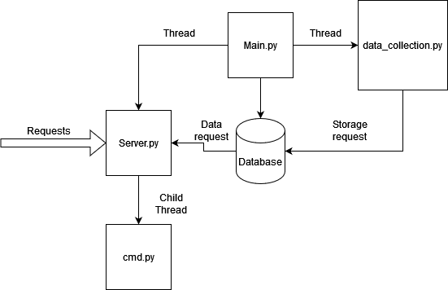
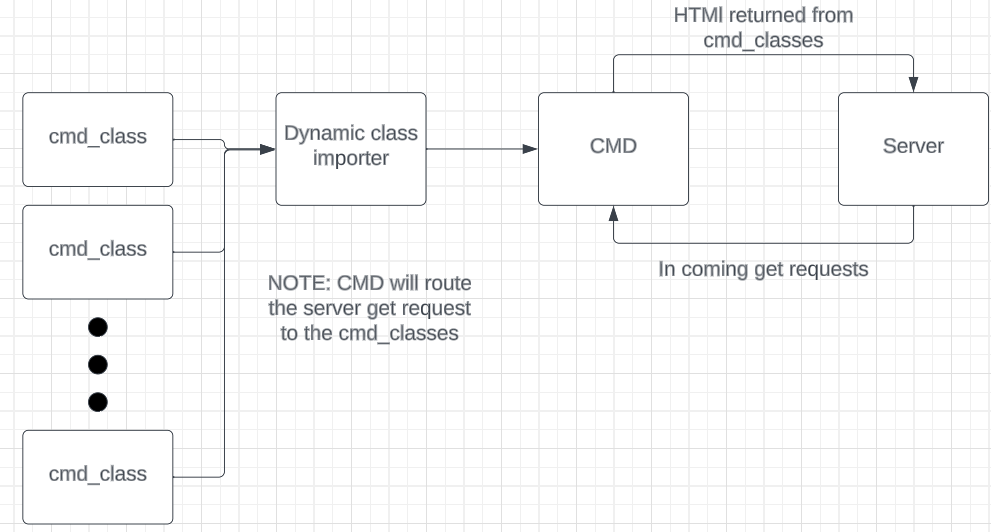
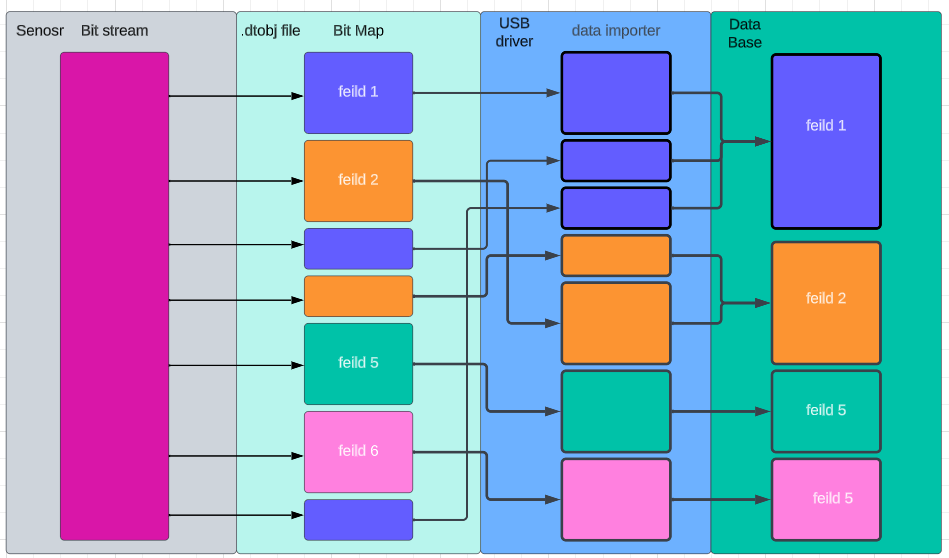

# Server overview
This document contains many exsamples. They are all write with 127.0.0.1 witch the home address when running on other computers this needs to be replace with the IP of the computer you want to talk to. 

## `Main.py` 
Handles starting and running the server. It also creates an object for `server`, `taskHandler` (threading), and `data_collection`.



## `Server`
This class handles all incoming request and routes them to `cmd` returns any html that `cmd` returns to the server.

### functions:
1. `__init__ `: this is pythons constructor. It builds the basic varibles needed for the class.

2. `run` : this function starts the server. It request the port and if it can access it then it starts the server up.

3. `do_get` : any request that comes into the server gets routed though this function. Then it handles writing any html back to the requester. 


## `Cmd`
This class handles any incoming commands. It has one very important varible and 3 member functions. 

### Varibles:
1. `self.__commandDict` : This is a python dictionary. It works like a list but instead of using numbers to index it, you can use what ever you want. In this case I use the names of the commands to index into the this dictionary. The dictionary contains a list of pointers to the classes that have been imported by the `dinamicImporter` class (see below). Basically when a get request comes the server the first arg is passed in to the dictionary to see if it maps to a class. \
EX: "127.0.0.1:5000/exsample", 'exsample' is used to index the dictionary.

### Functions:
1. `parseCmd`:  This funct handles passing commands and then calling the correct class using the self.__commandDict. \
NOTE:  The follow code is used to decided if there are any arguments that need to passed on to the the cmd class. 
\
EX: "127.0.0.1:5000/exsample" class ``.run()`` on the class where as "127.0.0.1:5000/exsample/args" calls `.run(message[1:])`. One other thing to note is that `message` is a LIST! So for the second EX it looks like `message = ['exsample', 'args']`. It is important that the LIST gets pass on to the class, and NOT and indivdual arg. This is so that if the user wishes to have mutiple args the server can suport this. \
EX: "127.0.0.1:5000/exsample/arg1/arg2/arg2" => `message = ['exsample', 'arg1', 'arg2', arg3]`. The command class will see `['arg1', 'arg2', arg3]`.

    ```python
    if(len(message) == 1):
            return self.__commandDict[message[0]].run()
        else :
            return self.__commandDict[message[0]].runArgs(message[1:])
    ```

2. `getCommandDict`: This class is a simple getter so that other class may see the command dictionary if they need it. 

3. `collectCommands`: This fuct calls the dinamicImporter class and then gets a list of modules, then it turns these modulas in to runable class. 

4. `__init__`: this func calls the `collectCommands` and sets up the `self.__commandDict`.

## `dinamicImporter`
This class is simple. All it does is search the current directry for any python file that is lead with `cmd_`. If it finds a file with that tag, it turns it into a python module and that can then be turn into a class and run as a commond by the server. \

(PS: I know dinamic spelled wrong but I speak spanish so to me its spelled just fine!)

### Functions:

1. `__init__` : this function finds all the `cmd_` python files and turns them into modules

2. `getModList`: returns the list of modules that can be run. 


 \


## `commandParent`
This class IS NOT strictly nessary for a functionality purpose. However, it is used to make it easier to make new commands. Bassically it has all the command function that have to be there for the server to run. If the user decides not to implement one of the functions the the command parent will have a basic version so that the server dose not fail. \
EX: if the user does not want a `runArgs(self, args)` function they dont need one.\
NOTE: I STRONGLY recomend having an `__int__` and `__str__` function dispite the command parent implementing them for you. 

## `cmd_exsample`
This clas is meant to be a helpo for the user as it provides an exsample of how to implement a `cmd_` class. 

### functions
1. `__init__`: this funct does sever imporant things. First it taks in the CMD arg. This is a refrence to the `Cmd` class. it will add its self to the command dictionary in that class with the flowing code

    ```python 
    dictCmd = CMD.getCommandDict()
    dictCmd[self.__comandName] = self #this is the name the webserver will see, so to call the command send a request for this command. 
    CMD.setCommandDict(dictCmd)
    ```
    The var `self.__commandName` this is the name of the command that the server will expect in order to run the command. \
    The last bit of code witch is VERY imporant is the following: \

    ```python
    self.__args ={
            "arg1" : self.func1
        }
    ```

    The `self.__args` var is how commands with args are run. Bassically this is a python dictinary that holds a pointer to a function, so when the dictionary is index with the key work "arg1" it calls `self.func1`. 

    EX: to call func1 send this get request `http://127.0.0.1:5000/exsample/arg1`

2. `run` : This  func gets called if no args are passed on the get request.

3. `renArgs` : this func gets called if args are passed on the get request. 

    ```python
    try:
        message += self.__args[args[0]](args)
    except :
        message += "<p> Not vaild arg </p>"
    ```

    The above code shows how the args are used to call a function. \
    NOTE: that `arg[0]` is used to index into the `self.__args` dictionary. \
    EX: `http://127.0.0.1:5000/exsample/arg1/arg2/arg3` `arg1` is passed into the dictionary. The list args contains `['arg1', 'arg2', 'arg3']`, thus `arg2` and `arg3` can be used in the function.\
    NOTE: `args` is always a list. This allows us to pass things into the fucntion. Where `self.__args` is a dictionary that is to be levarge by the interal class structure. 

4. `func1` : is an interal class function.
5. `getArgs` : is a getter used by the server to determin what argums the class suports. 
6. `__str__` : this is a function that other class relay on to determin the how to call this class. It returns the `self.__commandName` 

## `cmd_dataCollection`
This class is the connection between the data base and the server. It follows the `cmd_` format explained above.

### functions
1. `__self__` : This sets up the struct of the class, the most important thing is the args dictionary. 

    ```python
    self.__args ={
                "tables" : self.getTableHTML_Collector,
                "getDataType" : self.getDataType,
                "saveDummyData" : self.saveDummyData,
                "getData": self.getData,
            }
    ```

2. `runArgs` :This function follows the same format and function as the one discribed in `exsample`.
3. `getTableHTML_Collector` : This function ask the data base for all the tables it has and then returns an html file with those table names in it. 
4. `getArgs` : This function dose the same as the in `exsample`, however it does have some special cases for func that need special calls. Remeber this function returns html to the server that it then passes onto the ground staion. It is meant to let the user know how to call the functions. 

    ```python
    for key in self.__args:
        if(key == "getDataType"):
            message += f"<p>&emsp;/{key}/data group</p>"
        elif (key == "getData"):
            message += f"<p>&emsp;/{key}/data group/start time</p>"
        else :
            message += f"<p>&emsp;/{key}</p>"
    ```
5. `getDataTypes` : This funciton gets a data type and then returns it. It shows the feilds, bit make, and discontinuous mappings in a data type. This will alow the ground station to decode the data. \
EX: exsample call : `http://127.0.0.1:5000/data_Collector/getDataType/exsample`\

6. `saveDummyData` : This is used for testing the data base. It saves data into the `exsample` table.
7. `getData` : this function simply ask the data base for data and then returns it as html. One thing to note is that the args should contatin a start time for requestion the data. \
EX: exsample call : `http://127.0.0.1:5000/data_Collector/getData/exsample/0` returns all saved rows in the data base. \
EX: exsample call : `http://127.0.0.1:5000/data_Collector/getData/exsample/1694027663.3701735` returns all saved rows in the data base after and including time 1694027663.3701735. 
8. `__str__` : Follows the same format as `esample`.

## `databaseControl`
The holds all processed data. It can be query for the the information by the server. It also dynamically creats tales based on data groups in the `dataTypes.dtobj` file.\

### Functions 
1. `__init__` : This function makes a data base, then it goes though all the `dataTypes` collected by the `dataTypesImporter` and creates tables for them in the data base. 

    ```python 
    #make Maps for db creation
    self.__typeMap = { #the point of this dictinary is to map the type names from the dataTypes.dtobj file to 
                        # the sql data base.
        "int" : "INTEGER", 
        "float" : "FLOAT(10)", # NOTE: the (#) is the perscition of the float. 
        "string" : "TEXT",
        "bool" : "BOOLEAN",
        "bigint" : "BIGINT"
    } #  NOTE: this dict makes the .dtobj file syntax match sqlite3 syntax. 
    ```
    The above code is used for mapping the syntax of the `dataTypes.dtobj` file to `sql` syntax.
2. `insertData` : This function takes in a `dataType` and a list of data to insert. After that it mapps it into the data base.
3. `getTablesHTML` : returns the html with all the names of all tables in the data base.
4. `getTables_strLLIST` : returns a list with all the names of all tables in the data base.
5. `getDataType` : returns the data type class that has all the mapping for the data group.
6. `getfeilds` : returns the name of all the data feils in the data group.
7. `getData` : returns a html of all the data rows after a given time. 

## `dataTypes`
This class creeats a data obj that is based on the `dataTypes.dtobj` file. It used in every step of processing the data, from getting it from the bit stream to putting it in the data base, to requesting it from the data base. 

1. `__init__`: this function set up the class. There are three key varibles.

    ```python
    self.__feilds = {} #this dict contains all the data types that will be saved to the data base
    self.__bitMap = []# this list contains info on how to collect the bits from the bit stream. 
    self.__convertMap = {} #this dict contatins types that need to be mapped together. The MSB is the key.  
    ```

    `self.__feilds` is a dictionary of every feild that is present in the data group.
    `self.__bitMap` this is a list of how bits should be pulled out of the bit stream. 
    `self.__converMap` this is a dioctionary of how data feilds should be combined. 
2. `__str__` : returns an html represntation of the `dataType`, it shows the feilds, bit map, and the conver map.
3. All other function are just simple getters and setters. 

## `data importer`
This class takes the `dataTypes.dtobj` file and then turns it into `dataType` classes. That are then passed to `databaseControl`.

### Functions
1. `__init__` : Finds the `dataTypes.dtobj` file. 
2. `pasreDataTypes` : parses the syntax of the `dataTypes.dtobj` file.
3. `getDataTypes` : returns a dictionary of all the create `dataTypes`.
4. `__str__` : returns a html object of all the `dataTypes` that were found from the `dataTypes.dtobj` file.

## `dataTypes.dtobj`

This file defines ALL the data that needs to be pulled out of the bit stream. 

### RULES: 

1. Any line holding // is ignored. (basically this is how you comment)
2. Any line WITHOUT a tab is consider a data group name, and will be stored into the data base as that name.
3. Any line with a TABS will be consider a data type of the data group above it. These type of lines must have a : and >. \
 The format is `<name of data feild> : <number of bits> > <data type>`. \
 This format is used to collected data from the bit stream then store it into the database.\
 Data feild is the name of the data row to be added to the data base. \
 Number of bits is how many bits are in the bit stream from the sensor. \
 data type is the type that the collected data should be converted to.  
4. any line with # is ignored bits. This is inteded for a header or footer. These lines have the following format. 
 `# : <number of bits igrnored>`.
5. lines that contain the @ are for discontinuos bit streams. This means that bits somewhere else in the bit stream
 that need to be added to this feild. The syntax is: \
 `<name of data feild> : <number of bits> > <data type> @ <MSB feild> < <LSB feild>`\
 `<name of data feild> : <number of bits>` \
NOTE: the first feild in the file can be the MSB or the LSB. \
NOTE: this is consider the same rule 3, it just tells the bit map the bits out of order. \
NOTE: if you are going to do mulpile discontinuos types mapping to the same elment then the intermediate types must have a type cast of NONE. 
6. Data feilds are collected in the order that they appear in the data group. 
7. All feild names in a data group MUST BE unique. 
8. NO inline comments are allowed. 

## Data flow from `dataTypes.dtobj` file to `databaseControl`



## running idival classes

Most classes can be run on there own for testing sake. They are all ment to be run from the host folder however. If one fails to run check the imports. Sometimes they need to be changed. 

## running main
The command to run main is `python3 main.py` from the host folder. 

## testing server

## unit tests

## Logger
The logger class conatins acces to all the logs. It takes a message write it to the file it has access to and then flushes the file. Using this system makes the files more likely to servive if the system loses power. 

## Compling with pandocs
    To complie .md to a pdf: pandoc -s README.md -V geometry:margin=1in -o README.pdf
    To complie to a stand alone html doc: pandoc  --metadata title="README" -s --self-contained README.md -o README.html